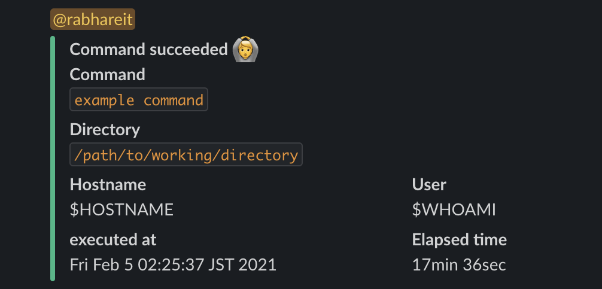
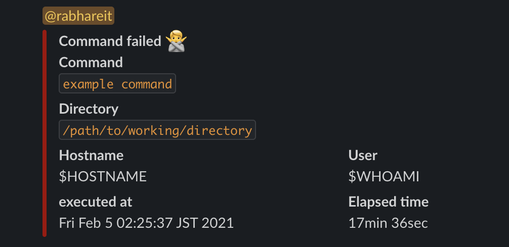

# hicaq

Send command status to slack




## configuration

Add your environment variable to
```
HICAQ_SLACK_WEBHOOK_URL="YOUR SLACK WOBHOOK URL"
HICAQ_SLACK_USER_NAME="YOUR SLACKID" # NOT username
```
If you don't need @ mention, you don't have to set `HICAQ_SLACK_USER_NAME`.

### add hicaq to zsh-hook
See `hicaq_hook.sh`

## usage
```sh
hicaq --command <COMMAND> --elapsed <ELAPSED> --executed-at <EXECUTED> --status <STATUS> [message]
```

### OPTIONS:
|short|long|description|
|---|---|---|
| -c | --command | Previous command name |
| -e | --elapsed | Elapsed time |
| -a | --executed-at | Executed at |
| -s | --status | Success(0) or fail(else) |

### ARGS:
|arg|description|
|---|---|
| message | Message sent with statu |
